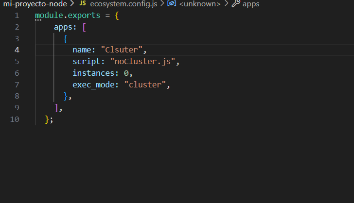
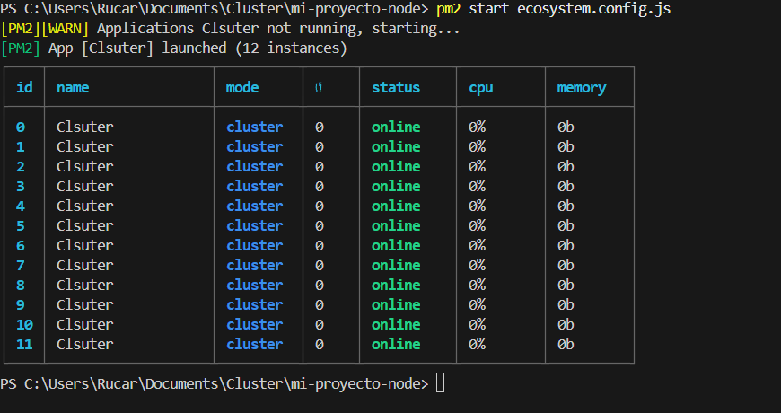
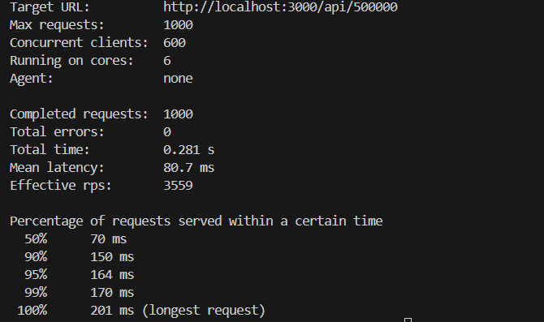
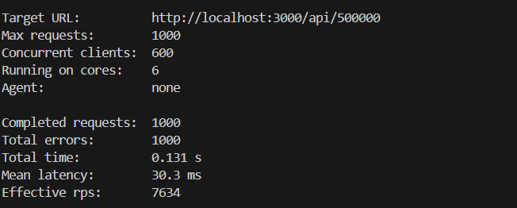

# mi-proyecto-node

## Usando los clusters

## Carlos Rodrñiguez Ruiz

### 2.1. Primero sin clúster

Para ver las ventajas que ofrece la agrupación en clústeres, comenzaremos con una aplicación de prueba en Node.js que no usa clústeres y la compararemos con una que sí los usa.

```javascript
const express = require("express");
const app = express();
const port = 3000;
const limit = 5000000000;

app.get("/", (req, res) => {
    res.send("Hello World!");
});

app.get("/api/:n", function (req, res) {
    let n = parseInt(req.params.n);
    let count = 0;
    if (n > limit) n = limit;
    for (let i = 0; i <= n; i++) {
        count += i;
    }
    res.send(`Final count is ${count}`);
});

app.listen(port, () => {
    console.log(`App listening on port ${port}`);
});
```

Esta aplicación contiene dos rutas: una ruta raíz `/` que devuelve la cadena "Hello World!" y otra ruta `/api/:n` donde se toma `n` como parámetro y realiza una operación de suma cuyo resultado se muestra al final.


### Pasos para ejecutar la aplicación

1. Conéctate al servidor Debian mediante SSH.
2. Crea un directorio para el proyecto de esta aplicación.
3. Dentro del directorio, ejecuta los siguientes comandos:
     - `npm init` para crear automáticamente la estructura de carpetas y el archivo `package.json`.
     - `npm install express` para instalar express para este proyecto.
4. Inicia la aplicación con: `node nombre_aplicacion.js`.

Para comprobarlo, accede a `http://IP-maq-virtual:3000` o a `http://IP-maq-virtual:3000/api/50`.

### 2.1.1. ¿Por qué ocurre esto?

Porque el único subproceso estará ocupado procesando la otra operación de ejecución prolongada. El único núcleo de la CPU tiene que completar la primera solicitud antes de que pueda encargarse de la otra.

### 2.2. ¡Ahora con más clúster!

Ahora usaremos el módulo de clúster en la aplicación para generar algunos procesos secundarios y ver cómo eso mejora las cosas.

```javascript
const express = require("express");
const port = 3000;
const limit = 5000000000;
const cluster = require("cluster");
const totalCPUs = require("os").cpus().length;

if (cluster.isMaster) {
    console.log(`Number of CPUs is ${totalCPUs}`);
    console.log(`Master ${process.pid} is running`);

    for (let i = 0; i < totalCPUs; i++) {
        cluster.fork();
    }

    cluster.on("exit", (worker, code, signal) => {
        console.log(`worker ${worker.process.pid} died`);
        console.log("Let's fork another worker!");
        cluster.fork();
    });
} else {
    const app = express();
    console.log(`Worker ${process.pid} started`);

    app.get("/", (req, res) => {
        res.send("Hello World!");
    });

    app.get("/api/:n", function (req, res) {
        let n = parseInt(req.params.n);
        let count = 0;
        if (n > limit) n = limit;
        for (let i = 0; i <= n; i++) {
            count += i;
        }
        res.send(`Final count is ${count}`);
    });

    app.listen(port, () => {
        console.log(`App listening on port ${port}`);
    });
}
```

Esta aplicación hace lo mismo que antes, pero esta vez estamos generando varios procesos secundarios que compartirán el puerto 3000 y que podrán manejar las solicitudes enviadas a este puerto.

### 3. Métricas de rendimiento

Realizaremos una prueba de carga en nuestras dos aplicaciones para ver cómo cada una maneja una gran cantidad de conexiones entrantes. Usaremos el paquete `loadtest` para esto.

Para usar `loadtest`, primero debemos instalarlo globalmente:

```sh
npm install -g loadtest
```

Luego ejecutamos la aplicación que queremos probar (`node nombre_aplicacion.js`). Comenzaremos probando la versión que no utiliza la agrupación en clústeres.

```sh
loadtest http://localhost:3000/api/500000 -n 1000 -c 100
```

### 4. Uso de PM2 para administrar un clúster de Node.js

En nuestra aplicación, hemos usado el módulo cluster de Node.js para crear y administrar manualmente los procesos. Existe una herramienta que nos puede ayudar a administrar todo esto un poco mejor: el administrador de procesos PM2.

Para usar PM2, primero instalamos globalmente en nuestra Debian:

```sh
npm install pm2 -g
```

Vamos a utilizarlo con nuestra primera aplicación, la que no estaba clusterizada en el código. Para ello ejecutaremos el siguiente comando:

```sh
pm2 start nombre_aplicacion_sin_cluster.js -i 0
```

Podemos detener la aplicación con el siguiente comando:

```sh
pm2 stop nombre_aplicacion_sin_cluster.js
```

Podemos crear un archivo de configuración llamado `ecosystem.config.js`:


Con m2



Ahora podemos ejecutar la aplicación con:

```sh
pm2 start ecosystem.config.js
```

Podremos iniciar, reiniciar, recargar, detener y eliminar una aplicación con los siguientes comandos, respectivamente:

```sh
pm2 start nombre_aplicacion
pm2 restart nombre_aplicacion
pm2 reload nombre_aplicacion
pm2 stop nombre_aplicacion
pm2 delete nombre_aplicacion
```

### 5. Cuestiones

Fijáos en las siguientes imágenes:



